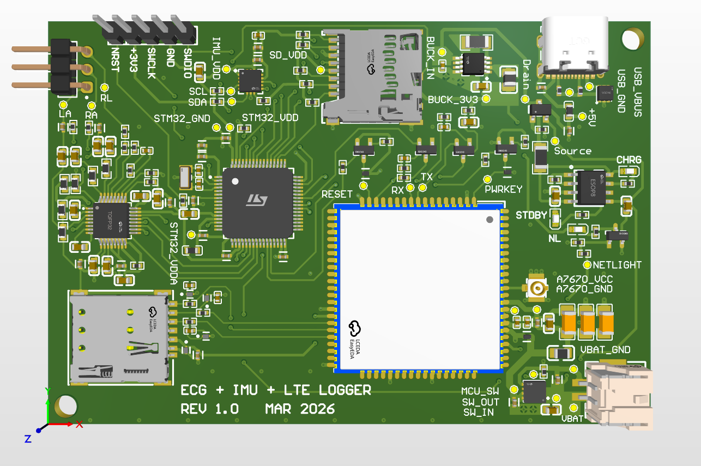
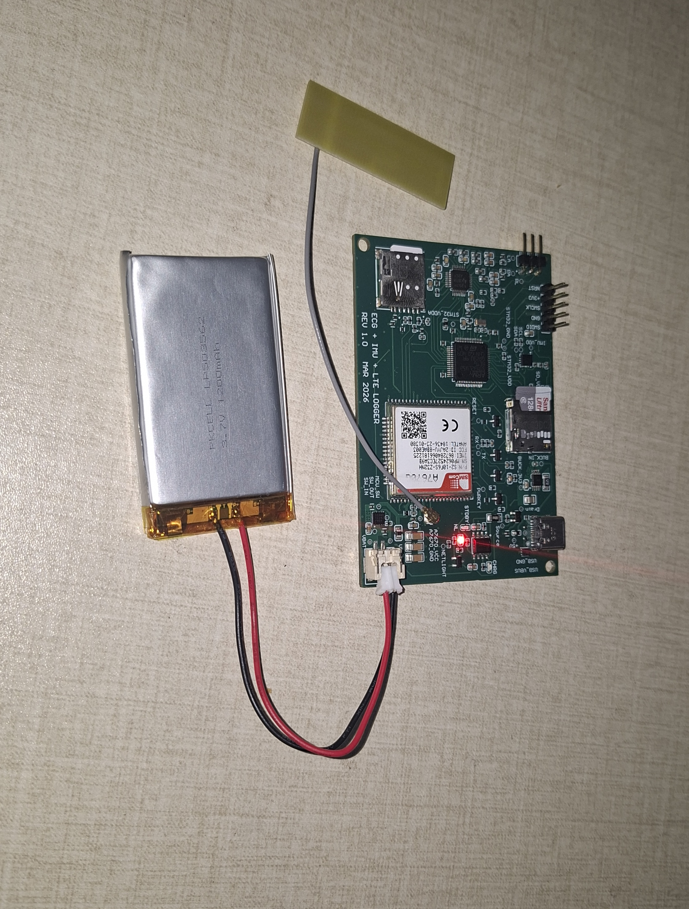

# ECG Monitoring and Telemetry — Battery-Powered Board

Firmware for the first, Li-Po-powered revision of the portable ECG monitor. This README describes the `v1-lipo-modem-gate` branch and its Rev 1 hardware. The board is an engineering prototype, not a certified medical device.

## Hardware

The board combines an STM32L452RET6, ADS1292R ECG front end, LIS3DH accelerometer, microSD socket, and SIMCom A7670G cellular modem. A single-cell Li-Po battery supplies the portable system; USB-C, a TP4056 charger, and a PMOS power path support charging and external power. STM32 PB8 controls a TPS22969 load switch on the modem supply. The modem's power-up and PWRKEY timing are specific to this board.

The ECG electrode connections are RA, LA, and RL. ADS1292R channel 2 carries the RA–LA measurement; channel 1 is internally shorted for diagnostics.

**Rev 1 PCB layout render**



**Assembled Rev 1 board with Li-Po battery and LTE antenna**



## What the firmware does

1. Initialize the MCU, device identity, microSD, LIS3DH, ADS1292R, and modem.
2. Recover completed `.RDY` recordings left on the SD card after a reset or failed connection.
3. Register on LTE, establish a data connection, and upload any queued files.
4. Record 2,500 ECG samples over approximately 10 seconds at 250 samples/s. Read LIS3DH motion at a lower rate and include its XYZ values in the ECG rows.
5. Write to `ACTIVE.TMP`, synchronize the file, and rename it to `.RDY` when complete.
6. Upload queued files to `https://ecg-dashboard-1h8s.onrender.com/api/ingest`. Delete a file only after HTTP 200; retain it for retry otherwise.
7. Repeat the recording and upload cycle. The modem normally stays powered between cycles.

The CSV contains the STM32 device identity and these six columns:

```text
timestamp,accel_x,accel_y,accel_z,ecg_ch1,ecg_ch2
```

Firmware also queries `AT+CPSI?` for the serving LTE cell. When available, MCC, MNC, TAC, and Cell ID are sent as optional `X-Network-*` HTTP headers; the CSV format is unchanged. TAC is the LTE counterpart of the 2G/3G LAC requested for the dashboard. A failed metadata query does not block an ECG upload.

## Project files

- `Core/Src/main.c` — acquisition, SD queue, modem, and upload state flow.
- `Core/Src/stm32l4xx_it.c` — ADS1292R data-ready interrupt handling.
- `FATFS/Target/` — SDMMC and FatFS integration.
- `ecg monitoring telemetry.ioc` — STM32CubeMX pin and peripheral configuration.
- [`docs/SD_FIRST_TELEMETRY.md`](docs/SD_FIRST_TELEMETRY.md) — SD-first behavior, diagnostics, and test observations.

Preserve the validated ADS1292R setup, SPI timing, SDMMC clock divider, and V1 modem power sequence when making changes.
